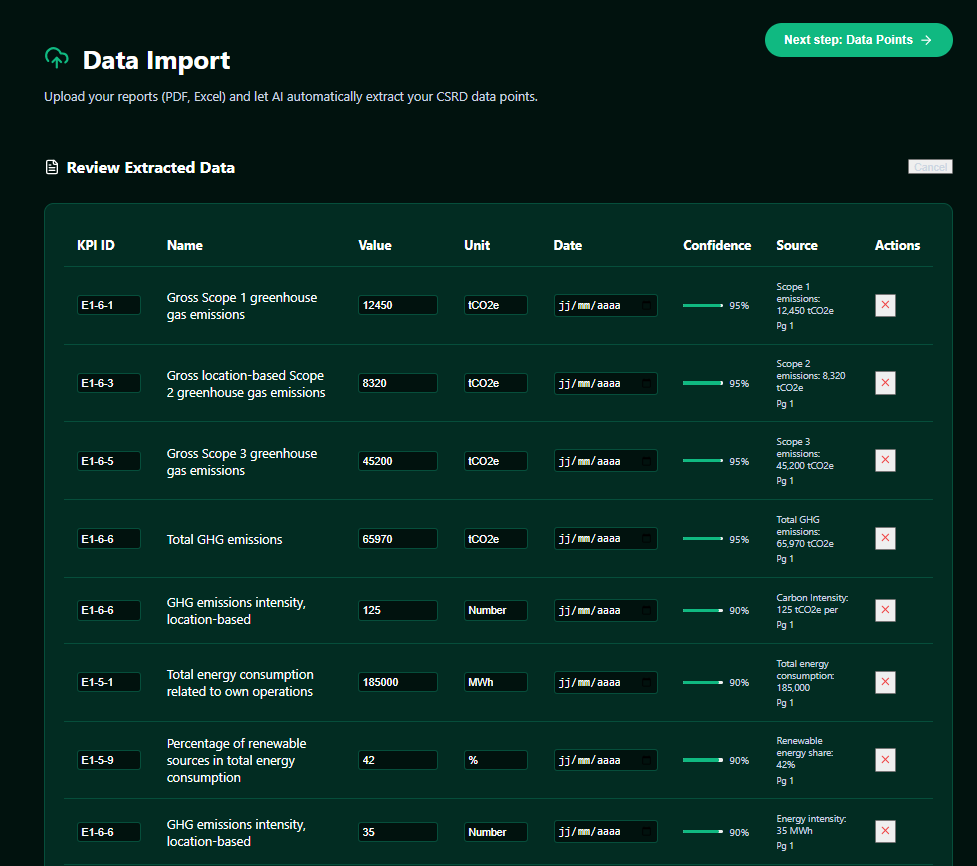
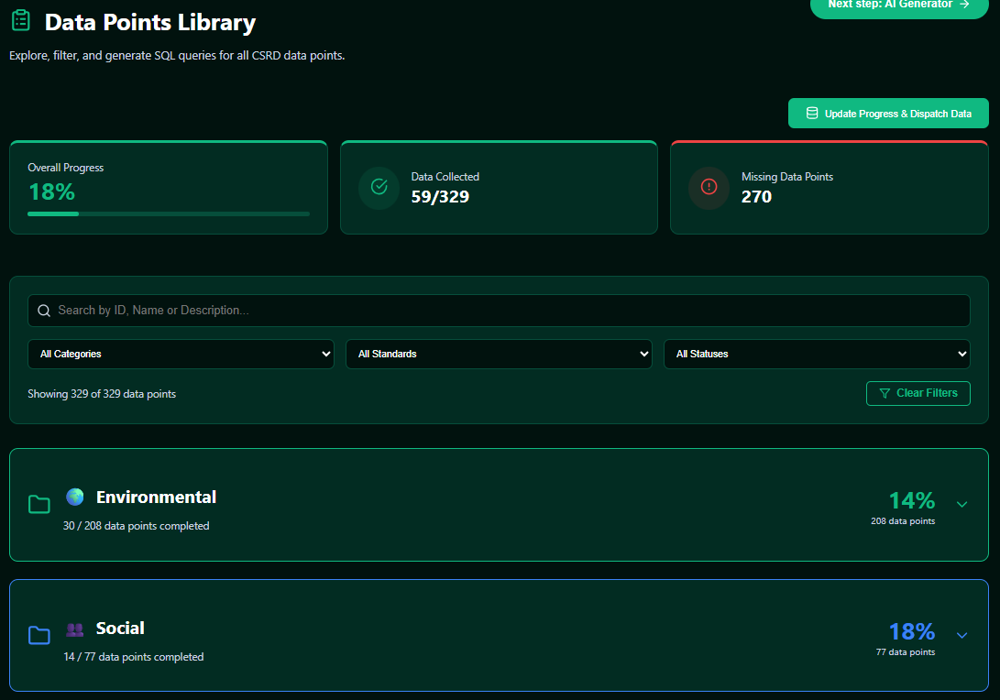
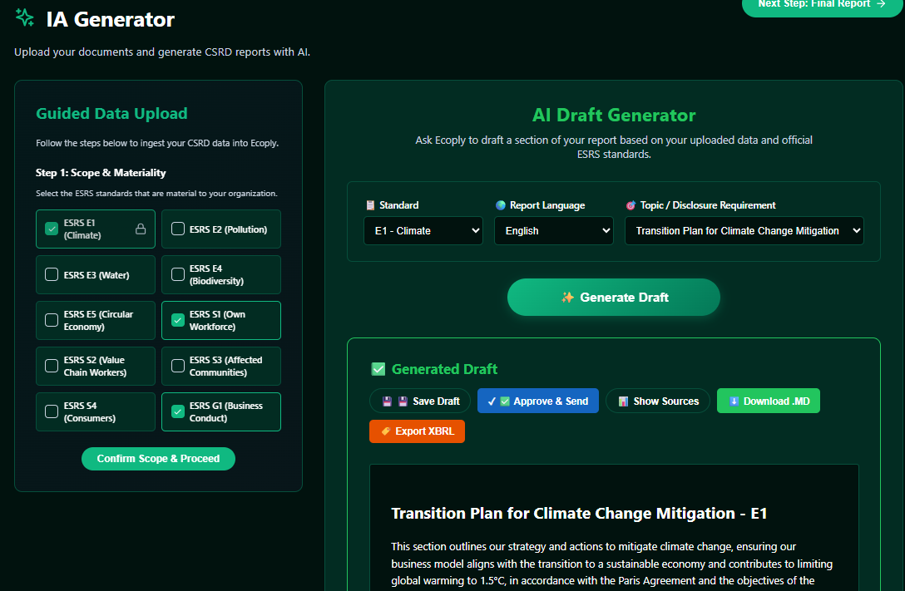
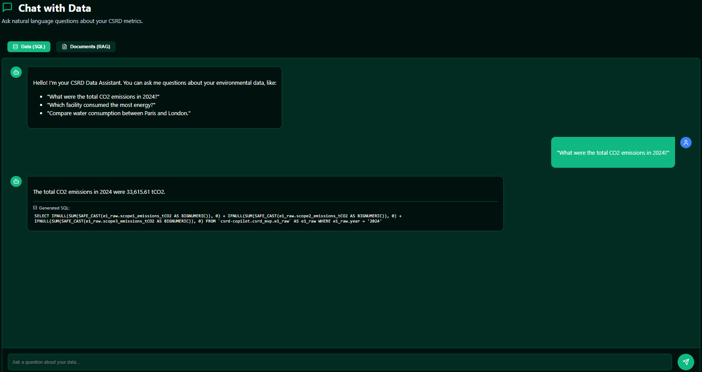
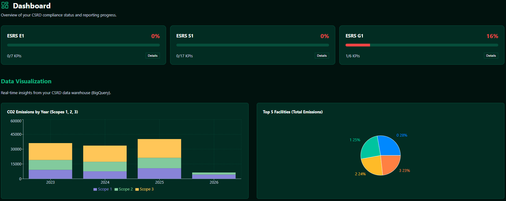
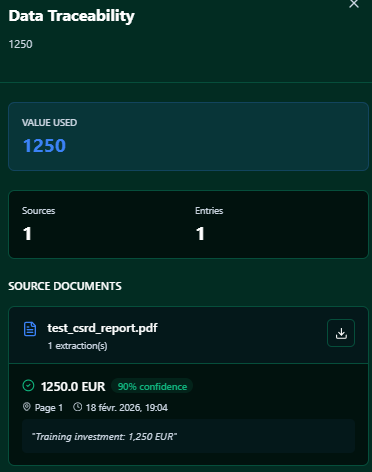
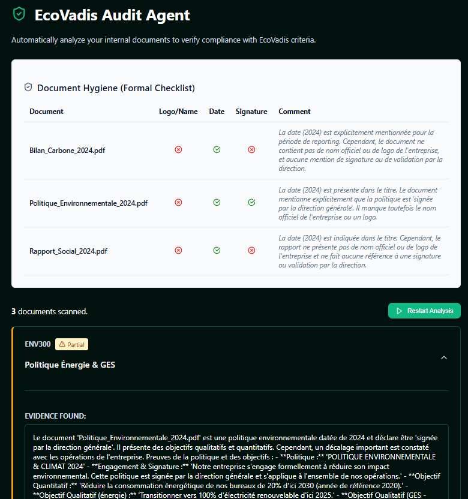
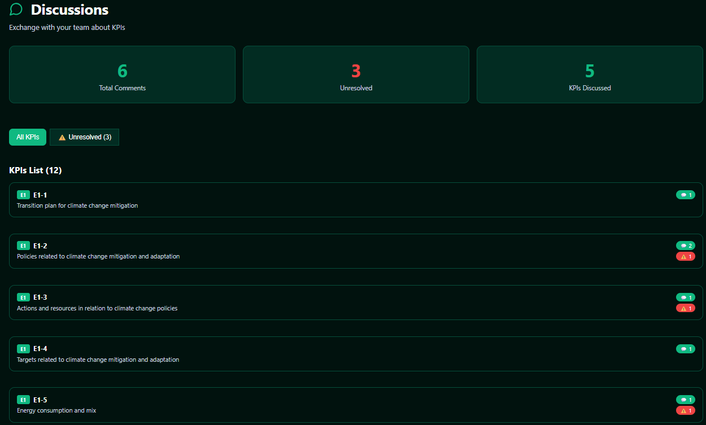
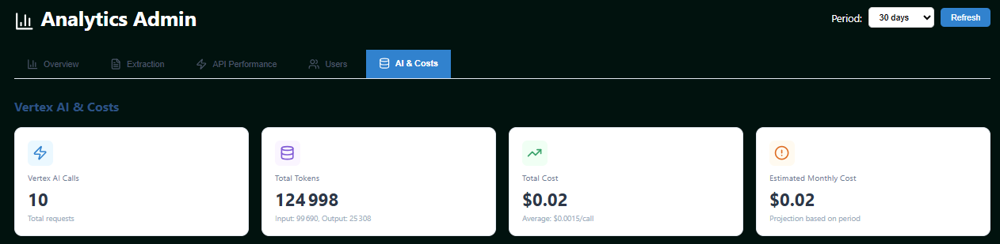

# 🌿 Ecoply — Your Intelligent CSRD Copilot

> **Version: BETA** · February 2026 · Built on Google Cloud Platform

Welcome to **Ecoply**, the full-stack platform that turns CSRD compliance into a smooth, AI-assisted experience.

The CSRD (Corporate Sustainability Reporting Directive) requires companies to collect thousands of data points and draft complex reports across 10 ESRS standards. Ecoply automates the heavy lifting — document extraction, data validation, report generation, and audit preparation — so you can focus on your sustainability strategy instead of data entry.

---

## 🚀 Why Ecoply?

CSR compliance shouldn't be a barrier. Ecoply leverages the power of Google Vertex AI to:

1. **Understand your documents** — Stop copy-pasting from invoices and PDFs. Our AI extracts indicators automatically.
2. **Map to ESRS standards** — Detected data is mapped to official datapoints (E1–E5, S1–S4, G1) for confirmation.
3. **Centralize your data** — A single source of truth for all your ESRS indicators in BigQuery.
4. **Check compliance** — Compare your data against the law in real time with a compliance progress dashboard.
5. **Draft for you** — Generate sourced, standards-compliant report sections in seconds via a multi-agent RAG pipeline.
6. **Collaborate** — Threaded discussions, @mentions, and resolution tracking on every KPI.
7. **Trace everything** — Full data lineage from source document to final report figure.

---

## ✨ Key Features (BETA)

### Smart import
Drag and drop any file (PDF, Excel, CSV, TXT). The AI analyzes the content, detects relevant indicators (e.g. "Energy Consumption", "Pay Gap", "Employees"), and maps them to official ESRS standards with a confidence score.
- Technology: **Gemini 2.0 Flash Lite** via Vertex AI
- Duplicate detection with conflict resolution modal
- Extraction metrics tracked per file (latency, confidence, row count)
<br> 

### Datapoints hub
Centralized dashboard to track your CSRD progress.
- Visualize which KPIs are completed, missing, or pending validation
- Validate AI-extracted data with one click
- Manual entry for missing data points
- Inline comments on each data point
<br>  

### Report generator (multi-agent RAG)
Our most powerful feature — a 3-phase AI pipeline:
1. **Strategist agent** — Generates a structured narrative draft using your real data + ESRS legal corpus
2. **Auditor agent** — Identifies 3 critical vigilance points (data anomalies, sector risks, compliance gaps)
3. **Consistency check** — Cross-validates figures and citations across the entire draft

- Combines your BigQuery data with ESRS legal texts (10 standards) and strategic guidance
- Every claim is sourced with `[[Source: ...]]` citation format
- Draft history with status tracking (Draft → Approved → Final)
- Export to **PDF** or **DOCX**
<br>  

### Chat with your data
Ask questions about your sustainability data in natural language. The AI responds based on your actual uploaded data, not hallucinations.
<br>  

### Impact dashboard
Visualize your environmental footprint via interactive **Recharts** visualizations:
- Carbon emissions by scope (1, 2, 3)
- Year-over-year comparisons
- KPI completion rates
- Progress bars per standard (E1–E5, S1–S4, G1)
- Gap analysis highlighting missing disclosures
- Regulatory timeline with upcoming deadlines
<br>  

### Data traceability (lineage)
Full transparency from source to report figure.
- Click any value to see its origin document, page number, and extraction snippet
- Confidence score per extraction
- Download the original source file as proof
- Search lineage records by KPI or source filename
<br>  

### EcoVadis audit preparation
Prepare your EcoVadis assessment score.
- Upload internal policies and sustainability reports
- AI scans documents against EcoVadis criteria (Ethics, Environment, Labor, Supply Chain)
- Gap analysis with actionable improvement suggestions
- Document coverage tracking per theme
<br>  

### Collaboration & comments
Discuss KPIs with your team directly in the app.
- Threaded comments on any data point or KPI
- @mention colleagues to request input
- Resolution tracking with event audit trail
- Comment metrics (response time, resolution rate)
<br>  

### Analytics & monitoring 
A dedicated admin dashboard with 5 tabs:
- **Overview** — API calls, active users, data volume
- **Extractions** — AI extraction success rates and timeseries
- **Confidence** — Score distributions and quality metrics
- **Feature adoption** — Usage per feature
- **Performance** — API latency and error rates
<br>  

### Data sources & connectors
- Manage connected data sources
- Salesforce connector (extensible architecture with abstract base class)
- Emission factors reference database
- CSV/Excel template downloads per standard

### RBAC (Role-Based Access Control)
Three roles with granular scope:
| Role | Permissions |
|---|---|
| **Admin** | Full access, user management, data purge, analytics |
| **Editor** | Create/edit reports, upload data, comment |
| **Reader** | View-only access to reports and dashboards |

Scopes: `global`, `environment`, `social`, `governance`

### Internationalization (i18n)
Full multi-language support with 800+ translated keys:
- 🇬🇧 English · 🇫🇷 French · 🇩🇪 German · 🇪🇸 Spanish
- Automatic browser language detection
- Seamless in-app language switching

---

## Architecture & tech stack

Ecoply is built on a modern, scalable architecture hosted entirely on **Google Cloud Platform**.

### Frontend
| Technology | Version | Purpose |
|---|---|---|
| React | 18.3.1 | UI framework |
| Vite | 5.4.1 | Build tool & dev server |
| React Router | 6.22.3 | Client-side routing (17 authenticated routes) |
| Firebase | 12.6.0 | Authentication (email/password) |
| i18next | 25.7.1 | Internationalization (4 languages) |
| Recharts | 2.12.0 | Data visualization / charts |
| Lucide React | 0.363.0 | Icon library |
| React Markdown | 10.1.0 | Markdown rendering in reports |

### Backend
| Technology | Purpose |
|---|---|
| FastAPI | Python API framework (47+ endpoints, 18 routers) |
| Uvicorn | ASGI server |
| Python 3.11 | Runtime |
| Vertex AI (Gemini 2.0 Flash Lite) | LLM for extraction, generation, audit |
| google-cloud-bigquery | Data warehouse client |
| google-cloud-storage | Raw file storage client |
| google-cloud-discoveryengine | Vertex AI Search (RAG retrieval) |
| firebase-admin | Auth token verification |
| simple-salesforce | Salesforce connector |
| pypdf / openpyxl | Document parsing (PDF, Excel) |
| python-docx / fpdf2 | Report export (DOCX, PDF) |

### Infrastructure
| Service | Role |
|---|---|
| **Cloud Run** (`europe-west1`) | Hosts the FastAPI backend (Docker, Python 3.11-slim) |
| **Cloud Functions** | GCS-triggered CSV ingestion (auto-detect E1/G1, validate, load to BigQuery) |
| **BigQuery** (`csrd_mvp` dataset) | Data warehouse — 13+ tables, 2 views, partitioned & clustered |
| **Cloud Storage** | Raw file storage (PDFs, CSVs, Excel) |
| **Firebase Auth** | User authentication |
| **Firebase Hosting** | Frontend deployment |
| **Dataform** | SQL-based data transformation (7 sqlx definitions) |

### AI / RAG pipeline
| Component | Description |
|---|---|
| **Model** | Gemini 2.0 Flash Lite (cascade fallback: 1.5-flash → 1.0-pro) |
| **Temperature** | 0.3 (tuned for factual compliance text) |
| **ESRS Corpus** | Full legal text coverage for all 10 standards (E1–E5, S1–S4, G1) |
| **4 AI Personas** | Base Consultant, Strategist, Compliance Officer, Auditor |
| **Strategist KB** | Best-in-class report examples, recommended phrasings, narrative structures |

### BigQuery 
| Table | Purpose |
|---|---|
| `e1_raw` / `g1_raw` | Raw uploaded CSV data |
| `e1_validated` / `g1_validated` | Validated/transformed KPI data |
| `draft_history` | Report drafts with status (Draft/Approved/Archived) |
| `audit_logs` | User action audit trail |
| `data_lineage` | KPI → source document provenance |
| `metrics_events` | API/extraction/generation metrics (partitioned by date) |
| `kpi_comments` | Threaded comments on KPIs |
| `comment_events` | Comment resolution/edit events |
| **Views**: `metrics_daily_summary`, `kpi_comment_threads` | Aggregated analytics |

---

## Getting started

### Prerequisites
- Node.js 18+ & npm
- Python 3.11+
- A Google Cloud project with **Vertex AI**, **BigQuery**, and **Cloud Storage** enabled
- Firebase project configured for Authentication

### Environment variables

**Frontend** (`.env` file in `frontend/`):
```env
VITE_FIREBASE_API_KEY=your-api-key
VITE_FIREBASE_AUTH_DOMAIN=your-project.firebaseapp.com
VITE_FIREBASE_PROJECT_ID=your-project-id
VITE_FIREBASE_STORAGE_BUCKET=your-project.appspot.com
VITE_FIREBASE_MESSAGING_SENDER_ID=123456789
VITE_FIREBASE_APP_ID=your-app-id
VITE_API_URL=http://localhost:8080
```

**Backend**: Uses Application Default Credentials on Cloud Run. For local dev, set `GOOGLE_APPLICATION_CREDENTIALS` to your service account key path.

### Quick installation

1. **Clone the project**
   ```bash
   git clone https://github.com/your-repo/csrd-copilot-mvp.git
   cd csrd-copilot-mvp
   ```

2. **Start the Backend**
   ```bash
   cd backend/api
   pip install -r requirements.txt
   uvicorn main:app --reload --port 8080
   ```

3. **Start the Frontend**
   ```bash
   cd frontend
   npm install
   npm run dev
   ```

4. **Open your browser** at `http://localhost:5173` and start exploring!

### Deploy to Cloud Run
```bash
gcloud run deploy csrd-api \
  --source backend/api \
  --region europe-west1 \
  --allow-unauthenticated \
  --timeout 300 \
  --project csrd-copilot
```

### Setup scripts
Deployment and setup scripts are available in `scripts/`:
- `deploy_api.ps1` / `deploy_api.sh` — Deploy backend to Cloud Run
- `deploy_function.ps1` — Deploy Cloud Function for CSV ingestion
- `setup_bigquery.ps1` / `reset_bigquery.ps1` — BigQuery table setup
- `create_comments_bq.ps1` — Comments system tables
- `setup_gcs.sh` — Cloud Storage bucket setup

---

## API endpoints (47+)

The backend exposes 47+ RESTful endpoints across 18 routers:

| Category | Endpoints | Description |
|---|---|---|
| **Core** | `POST /upload-data`, `GET /download-template/{standard}`, `GET /get-validated-data/{standard}` | File upload, templates, validated data |
| **Generation** | `POST /generate-draft` | Multi-agent RAG report generation |
| **Workflow** | `POST /save-draft`, `GET /history`, `POST /approve-draft`, `GET /final-report` | Draft lifecycle management |
| **Chat** | `POST /chat/data` | Natural language data queries |
| **Export** | `POST /export/pdf`, `POST /export/docx` | Report export |
| **Smart Extract** | `POST /data/smart-extract`, `GET /data/smart-extract-test` | AI document extraction |
| **Ingestion** | `POST /data/dispatch`, `GET /data/status`, `GET /data/history` | Data pipeline |
| **Lineage** | `GET /lineage/kpi/{kpi_id}`, `GET /lineage/search`, `GET /lineage/sources`, ... | Data traceability (6 endpoints) |
| **Comments** | `POST /comments`, `GET /comments/{kpi_id}`, `PUT /comments/{comment_id}`, ... | Collaboration system (10 endpoints) |
| **Analytics** | `GET /analytics/gap-analysis`, `GET /analytics/compliance-progress`, `GET /analytics/regulatory-timeline` | Compliance analytics |
| **Metrics** | `GET /metrics/dashboard`, `GET /metrics/analytics`, `GET /metrics/extraction/timeseries`, ... | Monitoring (5 endpoints) |
| **EcoVadis** | `POST /scan` | Document audit scan |
| **Connectors** | `POST /connectors/sync` | External data sync |
| **Admin** | `GET /users/list`, `POST /users/update`, `POST /purge-data` | User & data management |
| **Auth** | `GET /auth/profile` | RBAC profile |
| **Duplicates** | `POST /data/check-duplicates`, `POST /data/upsert-entries` | Deduplication |

---

## Project structure

```
csrd-copilot-mvp/
├── ai/                          # AI prompts & RAG knowledge bases
│   ├── prompts/                 # 4 AI persona prompts (strategist, compliance, auditor, base)
│   ├── rag_compliance/          # ESRS legal texts (E1, G1, Common)
│   ├── rag_strategist/          # Best-practice report examples
│   └── tests/                   # Jupyter notebooks for RAG testing
├── backend/
│   ├── api/                     # FastAPI application
│   │   ├── main.py              # App entry point, 18 routers
│   │   ├── Dockerfile           # Python 3.11-slim container
│   │   ├── models/              # JSON schemas (E1, G1, S1)
│   │   ├── routes/              # 18 route files (47+ endpoints)
│   │   ├── services/            # Business logic (RAG, comments, metrics, lineage, compliance)
│   │   ├── connectors/          # External data connectors (Salesforce)
│   │   ├── middleware/          # Metrics middleware with circuit breaker
│   │   ├── prompts/             # Duplicated AI prompts for backend
│   │   ├── rag_compliance/      # Full ESRS corpus (10 standards)
│   │   └── utils/               # Auth, RBAC, config, logging
│   ├── cloud_functions/         # GCS-triggered CSV ingestion
│   ├── dataform/                # SQL transformations (7 sqlx files)
│   └── sql/                     # BigQuery DDL scripts
├── data/                        # Demo data & CSV templates (E1, G1)
├── docs/                        # Architecture diagram, scope docs
├── frontend/
│   ├── src/
│   │   ├── App.jsx              # Router (17 authenticated routes)
│   │   ├── api/                 # API client
│   │   ├── components/          # 18 reusable components
│   │   ├── pages/               # 19 page components
│   │   ├── locales/             # i18n (en, fr, de, es — 800+ keys each)
│   │   ├── hooks/               # Custom React hooks
│   │   └── data/                # KPI definitions, ESRS reference
│   └── firebase.json
└── scripts/                     # Deployment & setup scripts (PS1, SH, PY)
```
### Completed in BETA
- [x] Multi-agent RAG report generation (Strategist + Auditor + Consistency)
- [x] Role-Based Access Control (Admin / Editor / Reader)
- [x] Data lineage & traceability panel
- [x] Threaded comments & collaboration system
- [x] EcoVadis audit preparation
- [x] Compliance progress dashboard (10 ESRS standards)
- [x] Analytics & monitoring admin dashboard (5 tabs)
- [x] Smart extraction with confidence scores
- [x] PDF & DOCX export
- [x] Internationalization (EN / FR / DE / ES)
- [x] Metrics middleware with circuit breaker
- [x] Duplicate detection & conflict resolution
- [x] Data sources management page
- [x] Chat with your data


## 📄 License

Internal project — Google Cloud x CSRD Copilot -- Antonin X Mathieu.
